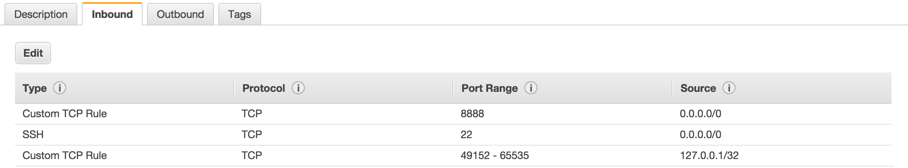

# giering-ami

To make this work, you'll need GNU make installed.  Also, you'll need a VPC set
up with a public subnet and the **default** security group looks like this:



Put credentials and the VPC and subnet identifiers into `aws.json` in the
current directory:

```json
{
  "aws_access_key_id": "????????????????????",
  "aws_secret_access_key": "????????????????????????????????????????",
  "subnet_id": "subnet-????????",
  "vpc_id": "vpc-????????"
}
```

From there, you can `make validate` to see that everything is correctly
formatted, or `make ami` in order to create an AMI.  For now this is in
`us-east-1`.
